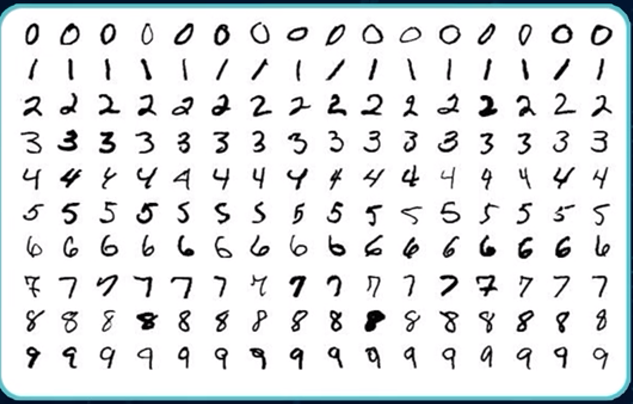
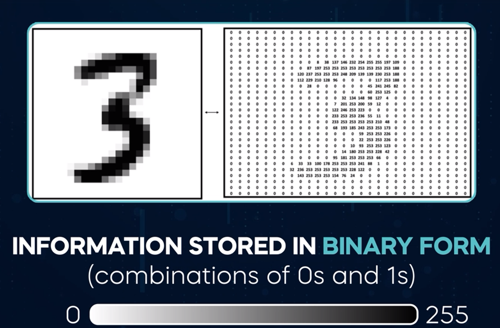
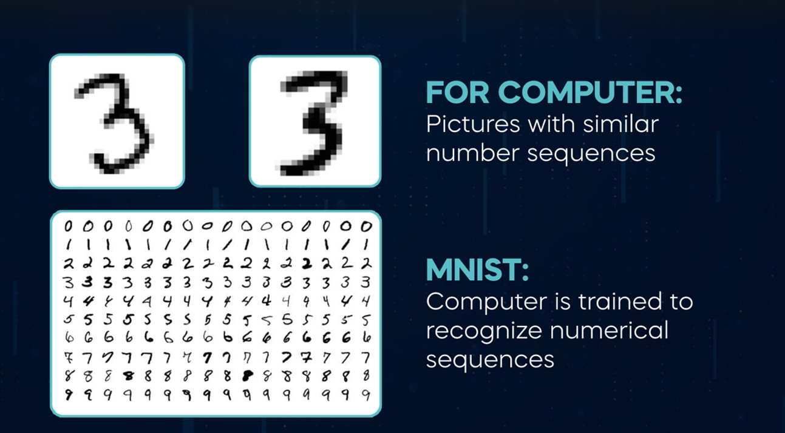

# Data
There are two main types of data structured and unstructured

## Structured Data
structured data is organized into rows and columns

## Unstractured Data
Unstructured data such as text files, images, videos and audio files lacks a defined structure and cannot be organized into rows and columns. 

**fun fact** 80 to 90% of all the world's data is unstructured data. This means that most data doesn't have this simple row column predefined field structure.
In the past, structured data was considered more valuable because it was easier to analyze.

### how have AI scientists made sense of so much unstructured data ???

## mNIST database

**mNIST database** is the hello world example for students who want to learn machine learning. The dataset includes 70,028 by 28 pixel grayscale images of handwritten digits. This exercise aims to train a machine learning algorithm to recognize the numbers we have in an image, even though they're never the same because people have different handwriting.

### fundamentals of computer science and electrical engineering.
All information can be broken down into zeros and ones. The handwritten number three can be represented in the following way. Each pixel in these images has a value between 0 and 255 that describes its shade of gray, where zero is white and 255 is black.

In computers, all information, including these pixel values is stored in binary form using combinations of zeros and ones. When we consider the pixel values in mNIST or any digital image, these numbers are converted into a binary format so computers can store and process them.

And We now Know we see different pictures of the number three, but they are pictures with similar number sequences for the computer

To solve the mNIST task via machine learning, the computer is trained to identify and differentiate these numerical sequences, enabling it to recognize digits from 0 to 9. This example is fundamental because it shows how we can turn different types of information from the world around us into data that computers can read. Similarly, videos are thousands of pictures composed of hundreds or even thousands of pixels. Each pixel in turn corresponds to a number represented in binary form with only zeros and ones. Even sound and written speech can be represented as sequenc es of zeros and ones. This is how computers receive the necessary structure to learn. They use this information to find patterns, study similarities, and ultimately learn how to execute different types of tasks.

AI researchers aspire to provide machines with such capabilities utilizing tools that collect data through sensors, video, audio, texts, social media, satellite images, and internet browsing patterns. They gather information by scraping the web, accessing APIs, and harnessing big data analytics. This wealth of data enables them to train algorithms, refine machine learning models, and enhance artificial intelligence systems to better understand and interact with the world.

## Labeled Labeled

## UnLabeled Data

## Metadata