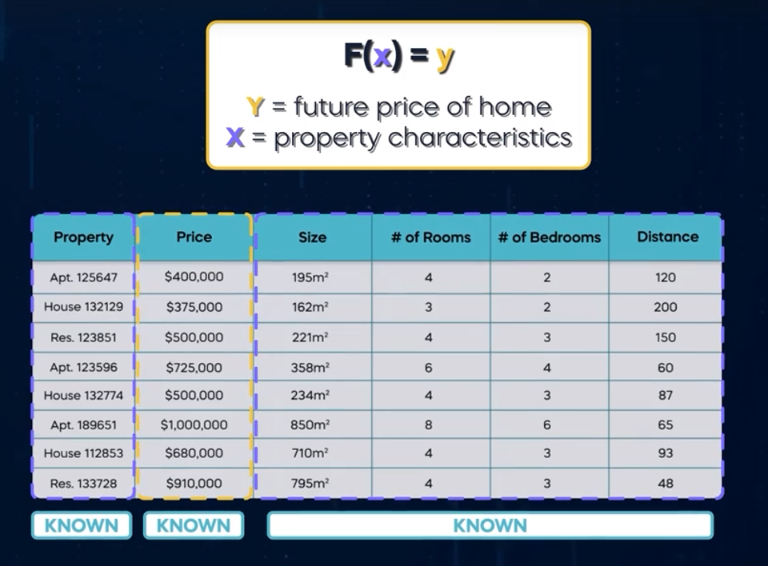

# Machine Learning
AI subfield pivotal to its recent success. The idea of ML is fascinating because it boils down to designing a system capable of learning and improving through a trial and error process. Consider building a machine learning model similar to a student taught by a teacher. In this case, the machine learning model is the student and the data scientist is the teacher. The teacher's role is to help the student learn how to solve problems. To do this well, the teacher must provide the student with many suitable learning materials, which in the world of machine learning, means providing a lot of good data. With sufficient information, the student carefully studies and absorbs the training materials. Similarly, the machine learning algorithm learns to recognize patterns in the fed training data. The aim is to prepare students to succeed on their final exam, featuring unfamiliar questions that test previously covered material in the ML models case, we aim to teach it how to solve a particular problem with data it has never seen. The more up to date and better the training data, the better the model can solve new challenging problems it has never seen without adequate training. A student may underperform compared to a well taught one, regardless of natural talent. The same goes for machine learning. A simple model with lots of good data might do better than a more complicated one with less data. Adopting new teaching methods and tailoring styles to students can significantly enhance their performance. Similarly, in machine learning, models improve prediction and analysis as they encounter new data types and updated algorithms. This continuous learning and adaptation process is crucial to developing robust AI systems that can handle diverse challenges and evolve.

## Study case
we familiar with the classic function notation, where y is a function of X, right?
Imagine we want to develop a machine learning model to predict house prices in our city By analyzing past real estate transactions in your training data set. So we have plenty of past transactions where both **X** and **Y** are known. We need to train a machine learning algorithm with historical data to discover patterns and learn the best way to predict the future price of a home **Y**, based on the data from past transactions and the home's known characteristics. Clients enter their home's characteristics into the app. This forms input x. The ML model then generates output **Y**, predicting the home's price based on similar historical data.

## Supervised Learning 
Supervised learning excels when we work with labeled data. In the earlier example, the training data set reveals whether a picture contains a dog. This is how the algorithm can learn to classify new pictures as dog or not dog. We've provided the ML model with an extensive training data set with labeled data, and it knows what to look for. Later, when we provide a new picture, it can identify whether it contains a dog based on the feedback given during training.

## Unsupervised Learning
Supervised learning excels when we work with unlabeled data.

## Reinforcement Learning
which operates without labeled data and is applied in pecific scenarios where the machine figures out how to reach a designated goal. Reinforcement learning shares with supervised ML the understanding of the desired output. But unlike supervised learning, we don't provide labeled data to the ML model. Instead, we create rules. The ML model learns through trial and error within specific parameters of our created rules. Reinforcement learning thrives in robotics and online recommendation systems.

# Deep Learning
Deep learning is a fascinating subset of machine learning inspired by how the human brain works.